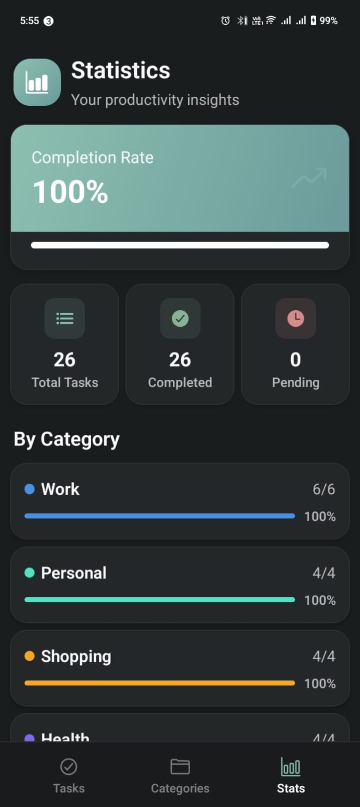
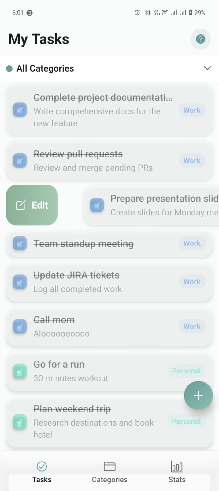
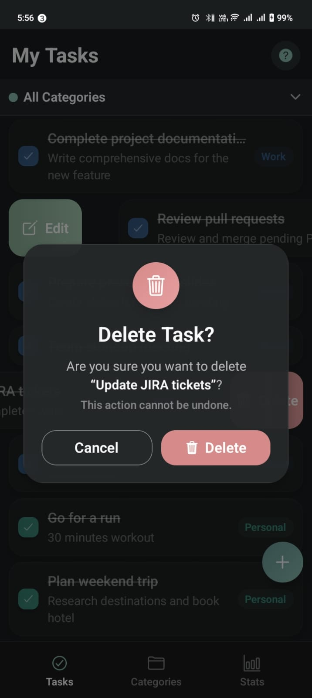
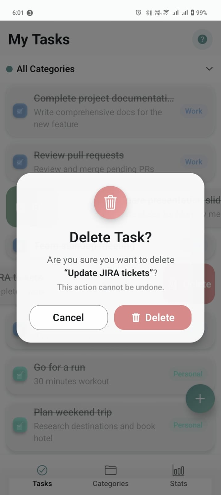
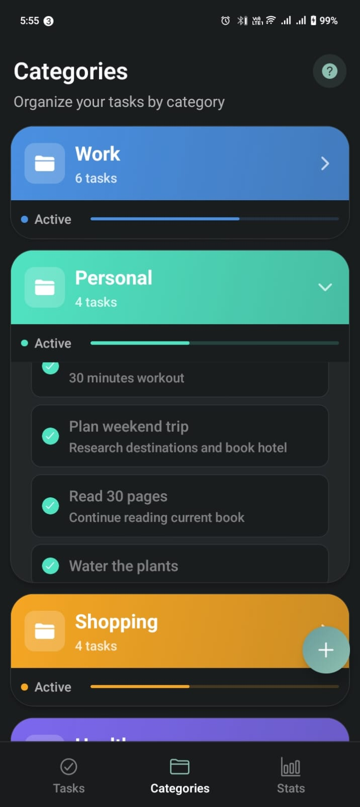
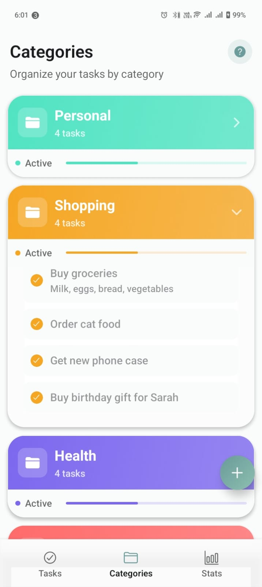
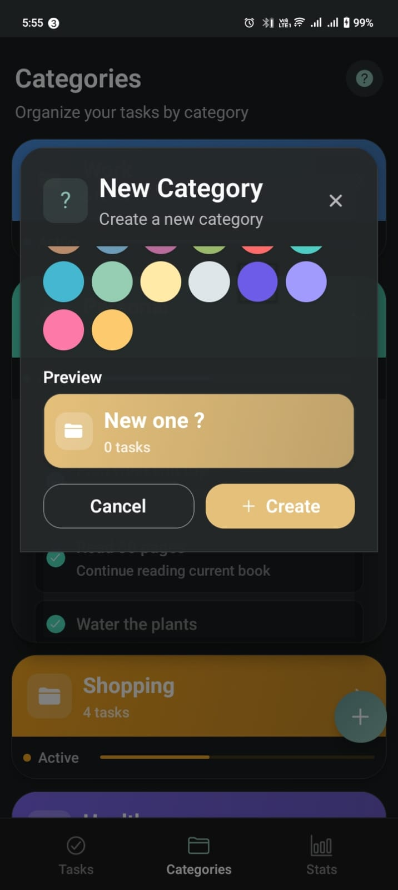
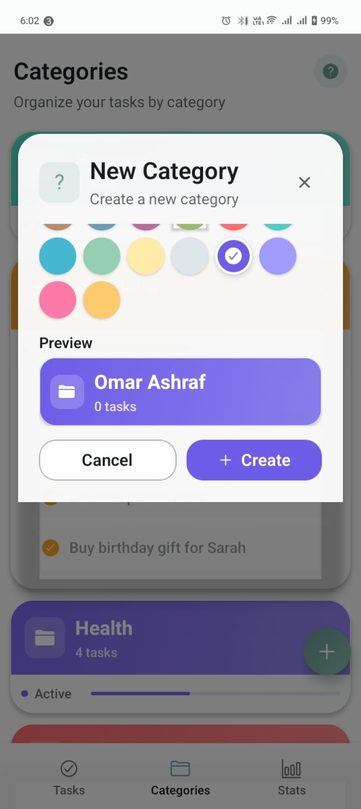
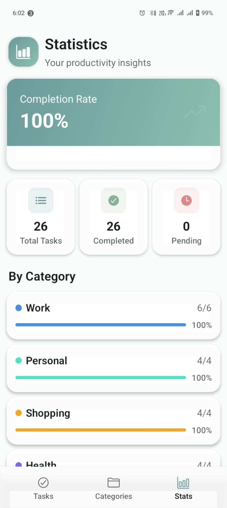

<div align="center">


# OneChapter Tasks

**A modern, gesture-driven Task Manager built with React Native & Expo**

[Features](#-features) • [Architecture](#-architecture) • [Tech Stack](#-tech-stack) • [Getting Started](#-getting-started) • [Design System](#-design-system) • [State Management](#-state-management)

</div>

---

## 📱 App Showcase

### 🌓 Dark & Light Theme Comparison

> Both themes are fully supported with seamless switching based on system preferences.

---

#### 1️⃣ Main Task List — Edit Gesture Enabled

| Dark Theme                                                  | Light Theme                                                   |
| ----------------------------------------------------------- | ------------------------------------------------------------- |
|  |  |

**Description:** The main task list displays all your tasks with a clean, card-based layout. Each task shows its title, description, completion status, and category badge. **Swipe right** on any task to reveal the **Edit gesture** (green gradient with pencil icon), allowing quick modifications. The interface features smooth spring animations and haptic feedback for a tactile experience.

---

#### 2️⃣ Main Task List — Delete Gesture Open

| Dark Theme                                                      | Light Theme                                                       |
| --------------------------------------------------------------- | ----------------------------------------------------------------- |
|  |  |

**Description:** **Swipe left** on any task to reveal the **Delete gesture** (red gradient with trash icon). The gesture-based interaction provides instant visual feedback with interpolated opacity animations. A confirmation dialog appears before permanent deletion, preventing accidental data loss.

---

#### 3️⃣ Categories Page Opened

| Dark Theme                                        | Light Theme                                         |
| ------------------------------------------------- | --------------------------------------------------- |
|  |  |

**Description:** The Categories screen organizes tasks into color-coded groups. Each category card displays the task count with an animated progress bar. **Tap any category** to expand and view its tasks inline with smooth height animations. Tasks can be toggled complete directly from the expanded view without navigation.

---

#### 4️⃣ New Category Modal Opened

| Dark Theme                                            | Light Theme                                             |
| ----------------------------------------------------- | ------------------------------------------------------- |
|  |  |

**Description:** The floating action button (FAB) opens a glassmorphic modal for creating new categories. Features a gradient icon header, rounded input fields with theme-aware borders, and a color picker for category customization. The modal uses spring-based entrance animations with backdrop blur effects.

---

#### 5️⃣ Statistics Page Opened

| Dark Theme                              | Light Theme                               |
| --------------------------------------- | ----------------------------------------- |
|  |  |

**Description:** The Statistics screen provides productivity insights with beautiful data visualizations. Features include:

- **Completion Rate Card** with gradient background and animated progress bar
- **Quick Stats Grid** showing Total, Completed, and Pending task counts
- **Category Breakdown** with per-category completion percentages
- Smooth entrance animations using Reanimated shared values

---

## ✨ Features

### Core Functionality

| Feature                     | Description                                                                      |
| --------------------------- | -------------------------------------------------------------------------------- |
| ✅ **Task Management**      | Create, complete, edit, and delete tasks with intuitive gestures                 |
| 🏷️ **Categories**           | Organize tasks with color-coded categories (Personal, Work, Health, Ideas, etc.) |
| 🔄 **Real-time Filtering**  | Instant category filtering without API calls — all data loaded locally           |
| 📊 **Statistics Dashboard** | Track completion rates, task counts, and per-category productivity metrics       |
| 🔍 **Category Dropdown**    | Quick filter to view tasks from specific categories or all categories            |

### User Experience

| Feature                    | Description                                                                |
| -------------------------- | -------------------------------------------------------------------------- |
| 🎨 **Dual Themes**         | Seamless light/dark mode support with theme-aware colors throughout        |
| ✨ **Smooth Animations**   | Physics-based spring animations using Reanimated 4.x for natural feel      |
| 📳 **Haptic Feedback**     | Tactile responses on all interactions (light, medium, warning intensities) |
| 🔔 **Toast Notifications** | Success/error feedback for all user actions                                |
| 👆 **Gesture Controls**    | Swipe left to delete, swipe right to edit — no buttons needed              |
| 💡 **Onboarding Hints**    | First-time gesture tutorial modal with auto-playing animations             |

### Technical Highlights

| Feature                       | Description                                                                |
| ----------------------------- | -------------------------------------------------------------------------- |
| 🧠 **Smart State Management** | Zustand for global UI state + TanStack Query patterns for data             |
| 💾 **Local Persistence**      | AsyncStorage for user preferences and onboarding state                     |
| 🎯 **Performance Optimized**  | Memoized components, FlatList optimization, worklet-based animations       |
| ♿ **Accessible**             | Screen reader support, semantic UI, proper touch targets (44x44pt minimum) |
| 📱 **Cross-Platform**         | iOS, Android, and Web support via Expo                                     |

---

## 🏗️ Architecture

### Clean Architecture Principles

This project follows **Clean Architecture** principles with clear separation of concerns across three layers:

```
┌─────────────────────────────────────────────────────────┐
│                    Presentation Layer                    │
│  ┌─────────────┐  ┌──────────────┐  ┌────────────────┐ │
│  │   Screens   │  │  Components  │  │   Navigation   │ │
│  │  (app/)     │  │ (components/)│  │  (expo-router) │ │
│  └─────────────┘  └──────────────┘  └────────────────┘ │
├─────────────────────────────────────────────────────────┤
│                    Domain Layer                          │
│  ┌─────────────┐  ┌──────────────┐  ┌────────────────┐ │
│  │   Stores    │  │    Hooks     │  │   Constants    │ │
│  │  (zustand)  │  │   (custom)   │  │   (design)     │ │
│  └─────────────┘  └──────────────┘  └────────────────┘ │
├─────────────────────────────────────────────────────────┤
│                    Data Layer                            │
│  ┌─────────────┐  ┌──────────────┐  ┌────────────────┐ │
│  │  Services   │  │   Utilities  │  │  Local Storage │ │
│  │  (business) │  │   (helpers)  │  │  (AsyncStorage)│ │
│  └─────────────┘  └──────────────┘  └────────────────┘ │
└─────────────────────────────────────────────────────────┘
```

### Folder Structure

```
todo/
├── app/                          # 📱 Expo Router Pages (Presentation Layer)
│   ├── (tabs)/                   # Tab navigation screens
│   │   ├── _layout.tsx           # Tab layout with custom glass tab bar
│   │   ├── index.tsx             # Home screen (task list with gestures)
│   │   ├── explore.tsx           # Categories screen (expandable cards)
│   │   └── stats.tsx             # Statistics screen (data visualization)
│   ├── _layout.tsx               # Root layout with providers
│   └── modal.tsx                 # Modal route
│
├── components/                   # 🧩 Reusable UI Components
│   ├── navigation/               # Custom navigation components
│   │   └── glass-tab-bar.tsx     # Glassmorphic bottom tab bar with blur
│   ├── task/                     # Task-specific components
│   │   ├── swipeable-task-card.tsx  # Main gesture-enabled task card
│   │   └── gradient-checkbox.tsx # Custom gradient checkbox component
│   ├── ui/                       # Base UI components
│   │   ├── gradient-fab.tsx      # Floating action button with gradient
│   │   └── ...
│   ├── animated-task-item.tsx    # Animated task row component
│   ├── create-category-modal.tsx # Modal for creating new categories
│   ├── create-task-modal.tsx     # Modal for creating new tasks
│   ├── delete-confirm-dialog.tsx # Confirmation dialog before deletion
│   ├── edit-task-modal.tsx       # Modal for editing existing tasks
│   ├── swipe-hint-modal.tsx      # First-time gesture tutorial modal
│   ├── task-item.tsx             # Basic (non-gesture) task item
│   ├── themed-text.tsx           # Theme-aware text component
│   └── themed-view.tsx           # Theme-aware view component
│
├── constants/                    # 🎨 Design System & Theme
│   ├── design-system.ts          # Color tokens, spacing, typography, shadows
│   ├── paper-theme.ts            # React Native Paper theme configuration
│   └── theme.ts                  # Platform-specific font configurations
│
├── hooks/                        # 🪝 Custom React Hooks
│   ├── use-color-scheme.ts       # System theme detection (light/dark)
│   ├── use-task-queries.ts       # TanStack Query hooks for data fetching
│   └── ...
│
├── lib/                          # 🔧 Core Libraries & Utilities
│   ├── services/                 # Business Logic Services
│   │   ├── task-service.ts       # Task CRUD operations (create, read, update, delete)
│   │   └── category-service.ts   # Category operations with task counts
│   └── utils/                    # Utility functions and helpers
│
├── stores/                       # 🧠 State Management (Zustand)
│   └── use-task-store.ts         # Global UI state (modals, filters, selections)
│
├── assets/                       # 🖼️ Static Assets
│   ├── images/                   # Static images
│   ├── fonts/                    # Custom fonts
│   └── chapterone.svg            # OneChapter logo
│
├── package.json                  # Dependencies and scripts
├── tsconfig.json                 # TypeScript configuration
├── babel.config.js               # Babel configuration (Reanimated plugin)
└── app.json                      # Expo configuration
```

### Component Hierarchy

```
App Root (_layout.tsx)
├── Providers (Theme, Query, SafeArea)
│
└── Tab Navigation (Tabs)
    ├── Tasks Tab (index.tsx)
    │   ├── Header (title + help button)
    │   ├── Category Dropdown
    │   ├── FlatList
    │   │   └── SwipeableTaskCard (repeated)
    │   │       ├── Delete Action Background (left swipe)
    │   │       ├── Edit Action Background (right swipe)
    │   │       └── Card Content (checkbox, title, description, badge)
    │   ├── GradientFAB
    │   └── Modals (Create, Edit, Delete Confirm, Swipe Hint)
    │
    ├── Categories Tab (explore.tsx)
    │   ├── Header (title + subtitle)
    │   ├── FlatList
    │   │   └── CategoryCard (repeated, expandable)
    │   │       ├── Gradient Header
    │   │       ├── Stats Row (progress bar)
    │   │       └── Expanded Content (nested task list)
    │   └── GradientFAB
    │
    └── Stats Tab (stats.tsx)
        ├── Header (icon + title)
        ├── Completion Rate Card
        ├── Quick Stats Grid (3 cards)
        └── Category Breakdown List
```

---

## 📦 Tech Stack

| Category             | Technology           | Version | Purpose                                           |
| -------------------- | -------------------- | ------- | ------------------------------------------------- |
| **Framework**        | Expo                 | SDK 54  | Cross-platform development with managed workflow  |
| **Routing**          | Expo Router          | 6.0     | File-based navigation with deep linking support   |
| **UI Library**       | React Native Paper   | 5.15    | Material Design components with theming           |
| **State Management** | Zustand              | 5.0     | Lightweight global state for UI (modals, filters) |
| **Data Fetching**    | TanStack Query       | 5.90    | Server state caching and background sync patterns |
| **Animations**       | Reanimated           | 4.1     | Physics-based animations running on UI thread     |
| **Gestures**         | Gesture Handler      | 2.28    | Native touch gesture recognition and handling     |
| **Storage**          | AsyncStorage         | 2.2     | Local data persistence for preferences            |
| **Notifications**    | Toast Notifications  | 3.4     | User feedback with success/error toasts           |
| **Icons**            | Expo Vector Icons    | 15.0    | Icon library (Ionicons)                           |
| **Gradients**        | Expo Linear Gradient | 15.0    | Gradient backgrounds for cards and buttons        |
| **Blur**             | Expo Blur            | 15.0    | Glassmorphism effects on tab bar and modals       |
| **Haptics**          | Expo Haptics         | 15.0    | Tactile feedback for user interactions            |
| **Safe Area**        | Safe Area Context    | 5.6     | Handle device notches and safe areas              |
| **Language**         | TypeScript           | 5.9     | Type-safe JavaScript with strict mode             |

---

## 🎨 Design System

### Color Palette

#### Light Mode Colors

| Token          | Value                    | Usage                                 |
| -------------- | ------------------------ | ------------------------------------- |
| Primary        | `#6B9B9A`                | Main actions, accents, active states  |
| Secondary      | `#8DBFB0`                | Supporting elements, gradients        |
| Tertiary       | `#A8C9B2`                | Success states, completion indicators |
| Background     | `#FAFBFB`                | Base app background                   |
| Surface        | `rgba(255,255,255,0.95)` | Cards, modals, elevated surfaces      |
| Error          | `#D68A8A`                | Delete actions, error states          |
| Warning        | `#E5C07B`                | Warning indicators                    |
| Success        | `#8AB096`                | Completed tasks, success feedback     |
| Text Primary   | `#1A1D1E`                | Main text content                     |
| Text Secondary | `rgba(26,29,30,0.68)`    | Supporting text                       |
| Text Tertiary  | `rgba(26,29,30,0.45)`    | Captions, hints                       |

#### Dark Mode Colors

| Token          | Value                    | Usage                                 |
| -------------- | ------------------------ | ------------------------------------- |
| Primary        | `#8DBFB0`                | Main actions, accents, active states  |
| Secondary      | `#6B9B9A`                | Supporting elements, gradients        |
| Tertiary       | `#A8C9B2`                | Success states, completion indicators |
| Background     | `#1A1D1E`                | Base app background                   |
| Surface        | `rgba(37,40,41,0.95)`    | Cards, modals, elevated surfaces      |
| Error          | `#D68A8A`                | Delete actions, error states          |
| Warning        | `#E5C07B`                | Warning indicators                    |
| Success        | `#8AB096`                | Completed tasks, success feedback     |
| Text Primary   | `#FAFBFB`                | Main text content                     |
| Text Secondary | `rgba(250,251,251,0.68)` | Supporting text                       |
| Text Tertiary  | `rgba(250,251,251,0.45)` | Captions, hints                       |

### Gradient System

| Gradient            | Colors                            | Usage                             |
| ------------------- | --------------------------------- | --------------------------------- |
| Primary Gradient    | `#6B9B9A` → `#8DBFB0`             | Headers, buttons, accents         |
| Background Gradient | `#FAFBFB` → `#F5F7F7` → `#FAFBFB` | Light mode app background         |
| Background Gradient | `#1A1D1E` → `#151718` → `#1A1D1E` | Dark mode app background          |
| Delete Gradient     | `#D68A8A` → `#E8A0A0`             | Swipe-to-delete action background |
| Edit Gradient       | `#8AB096` → `#A8C9B2`             | Swipe-to-edit action background   |

### Typography Scale

| Token          | Font Size | Font Weight    | Line Height | Usage               |
| -------------- | --------- | -------------- | ----------- | ------------------- |
| Display Large  | 32px      | 700 (Bold)     | 40px        | Screen titles       |
| Display Medium | 24px      | 600 (SemiBold) | 32px        | Section headers     |
| Headline       | 20px      | 600 (SemiBold) | 28px        | Card titles         |
| Body Large     | 17px      | 400 (Regular)  | 24px        | Prominent body text |
| Body           | 15px      | 400 (Regular)  | 22px        | Standard body text  |
| Caption        | 13px      | 500 (Medium)   | 18px        | Labels, hints       |

### Spacing Scale (4px Grid)

| Token | Value | Usage                          |
| ----- | ----- | ------------------------------ |
| xs    | 4px   | Micro spacing, icon gaps       |
| sm    | 8px   | Tight spacing, badge padding   |
| md    | 12px  | Standard spacing, card padding |
| lg    | 16px  | Section spacing, modal padding |
| xl    | 24px  | Large section gaps             |
| 2xl   | 32px  | Major section separation       |
| 3xl   | 48px  | Hero spacing                   |

### Border Radius

| Token | Value  | Usage                    |
| ----- | ------ | ------------------------ |
| sm    | 8px    | Small buttons, badges    |
| md    | 12px   | Cards, input fields      |
| lg    | 20px   | Large cards, modals      |
| xl    | 28px   | Modal containers         |
| full  | 9999px | Circular elements, pills |

### Shadows

#### Light Mode Shadows

| Token | Value                         | Usage                 |
| ----- | ----------------------------- | --------------------- |
| sm    | `0 2px 8px rgba(0,0,0,0.06)`  | Subtle elevation      |
| md    | `0 4px 16px rgba(0,0,0,0.08)` | Standard cards        |
| lg    | `0 8px 32px rgba(0,0,0,0.12)` | Modals, FABs          |
| glass | `0 8px 32px rgba(0,0,0,0.06)` | Glassmorphic elements |

#### Dark Mode Shadows

| Token | Value                         | Usage                 |
| ----- | ----------------------------- | --------------------- |
| sm    | `0 2px 8px rgba(0,0,0,0.2)`   | Subtle elevation      |
| md    | `0 4px 16px rgba(0,0,0,0.3)`  | Standard cards        |
| lg    | `0 8px 32px rgba(0,0,0,0.4)`  | Modals, FABs          |
| glass | `0 8px 32px rgba(0,0,0,0.15)` | Glassmorphic elements |

### Animation System

| Token            | Value | Usage                                     |
| ---------------- | ----- | ----------------------------------------- |
| Fast Duration    | 150ms | Micro-interactions, press feedback        |
| Normal Duration  | 200ms | Standard transitions, modal entrances     |
| Slow Duration    | 300ms | Major state changes, screen transitions   |
| Spring Damping   | 15    | Controls oscillation in spring animations |
| Spring Stiffness | 150   | Controls speed in spring animations       |

---

## 🧠 State Management

### Architecture Overview

The app uses a **hybrid state management approach** combining multiple patterns for optimal performance and maintainability:

```
┌─────────────────────────────────────────────────────────┐
│                    State Layers                          │
├─────────────────────────────────────────────────────────┤
│  UI State (Zustand)                                     │
│  • Modal visibility (create, edit, delete)              │
│  • Selected category filter                             │
│  • Global UI flags                                      │
├─────────────────────────────────────────────────────────┤
│  Component State (React useState/useReducer)            │
│  • Animation values (shared values in Reanimated)       │
│  • Local form state                                     │
│  • Temporary UI state (loading, expanded)               │
├─────────────────────────────────────────────────────────┤
│  Data State (Services + Local Storage)                  │
│  • Tasks (loaded from AsyncStorage/service layer)       │
│  • Categories (loaded from AsyncStorage/service layer)  │
│  • User preferences (theme, onboarding state)           │
└─────────────────────────────────────────────────────────┘
```

### Zustand Store (Global UI State)

**File:** `stores/use-task-store.ts`

| State                   | Type           | Description                                     |
| ----------------------- | -------------- | ----------------------------------------------- |
| `isCreateModalVisible`  | boolean        | Controls visibility of create task modal        |
| `setCreateModalVisible` | function       | Setter for create modal visibility              |
| `selectedCategoryId`    | string \| null | Currently selected category filter (null = all) |
| `setSelectedCategoryId` | function       | Setter for category filter                      |

**Why Zustand:**

- Minimal boilerplate compared to Redux
- No providers needed — import and use directly
- Automatic subscription management
- TypeScript-first design
- Small bundle size (~1KB)

### Component State (Local State)

**Used for:**

- Animation shared values (Reanimated)
- Form input values
- Loading states
- Expanded/collapsed states
- Temporary UI flags

**Example Pattern:**

```typescript
// Animation values (run on UI thread)
const translateX = useSharedValue(0);
const scale = useSharedValue(1);
const opacity = useSharedValue(1);

// React state for UI flags
const [isLoading, setIsLoading] = useState(true);
const [expanded, setExpanded] = useState(false);
const [taskToDelete, setTaskToDelete] = useState<Task | null>(null);
```

### Data Flow

```
User Action → Service Layer → State Update → UI Re-render
     ↓
  Haptic Feedback + Toast Notification
     ↓
  Animation Trigger (if applicable)
```

**Task Creation Flow:**

1. User taps FAB → Zustand sets `isCreateModalVisible = true`
2. Modal appears with spring animation
3. User fills form and submits
4. `taskService.create()` called
5. On success: Toast notification + reload tasks
6. On error: Error toast displayed
7. Modal dismissed

**Gesture Flow:**

1. User swipes card → Gesture Handler detects pan
2. `translateX` shared value updated in real-time
3. Action background opacity interpolated based on swipe distance
4. Threshold reached (80px) → auto-complete to full swipe
5. Haptic feedback triggered (Medium for edit, Warning for delete)
6. Callback fired after animation completes (300ms delay)

---

## 🎯 User Interactions

### Gesture System

#### Swipe Left → Delete

| Aspect                    | Implementation                                        |
| ------------------------- | ----------------------------------------------------- |
| **Trigger**               | Pan gesture with activeOffsetX of [-10, 10]           |
| **Threshold**             | 80px swipe distance                                   |
| **Visual Feedback**       | Red gradient background slides in from right          |
| **Opacity Interpolation** | Fade from 0 to 1 as swipe progresses from 0 to -100px |
| **Haptic**                | Warning feedback on threshold crossed                 |
| **Completion**            | Spring animation to -150px, then callback after 300ms |
| **Safety**                | Confirmation dialog before permanent deletion         |

#### Swipe Right → Edit

| Aspect                    | Implementation                                       |
| ------------------------- | ---------------------------------------------------- |
| **Trigger**               | Pan gesture with activeOffsetX of [-10, 10]          |
| **Threshold**             | 80px swipe distance                                  |
| **Visual Feedback**       | Green gradient background slides in from left        |
| **Opacity Interpolation** | Fade from 0 to 1 as swipe progresses from 0 to 100px |
| **Haptic**                | Medium impact feedback on threshold crossed          |
| **Completion**            | Spring animation to 150px, then callback after 200ms |
| **Safety**                | Edit modal pre-populated with existing data          |

#### Tap/Press → Select

| Aspect         | Implementation                                 |
| -------------- | ---------------------------------------------- |
| **Press In**   | Scale down to 0.98 with spring animation       |
| **Press Out**  | Scale back to 1.0                              |
| **Haptic**     | Light impact feedback on press in              |
| **Long Press** | 300ms delay triggers optional secondary action |

#### Checkbox Toggle → Complete/Uncomplete

| Aspect        | Implementation                           |
| ------------- | ---------------------------------------- |
| **Visual**    | Checkbox fills with category color       |
| **Opacity**   | Task fades to 0.5 opacity when completed |
| **Haptic**    | Light impact feedback                    |
| **Animation** | 250ms timing animation for smooth fade   |

### Animation System

#### Spring Animations (Physics-based)

Used for:

- Card press feedback (scale)
- Gesture completion (translateX)
- Modal entrances (scale + fade)
- Tab indicator sliding

**Configuration:**

```
Damping: 15 (controls oscillation)
Stiffness: 150 (controls speed)
```

#### Timing Animations (Duration-based)

Used for:

- Opacity fades (completion toggle)
- Modal fade ins
- Entrance animations

**Common Durations:**

- Fast: 150ms (micro-interactions)
- Normal: 200ms (standard transitions)
- Slow: 300ms (major state changes)

#### Interpolation

Used for:

- Action background opacity during swipe
- Chevron rotation in expandable cards
- Progress bar fills

**Pattern:**

```
Input Range: [-100, -50, 0]
Output Range: [1, 0.5, 0]
Result: Opacity fades as swipe resets
```

---

## 📐 Key Design Decisions

### 1. Gesture-First Interaction Model

**Decision:** Use swipe gestures as primary interaction method instead of action buttons.

**Rationale:**

- Reduces visual clutter on task cards
- Faster interaction once learned (muscle memory)
- Native mobile pattern (familiar to users)
- Enables single-hand operation
- Provides satisfying tactile experience with haptics

**Trade-offs:**

- Requires onboarding hint for first-time users
- Less discoverable than visible buttons
- Mitigated by: Swipe hint modal with auto-playing animations

### 2. Local-First Data Architecture

**Decision:** Load all tasks once, filter in-memory instead of querying per-filter.

**Rationale:**

- Instant filtering (no network delay)
- Better perceived performance
- Works offline
- Reduces API/service calls

**Trade-offs:**

- Higher initial load time
- More memory usage
- Acceptable for task manager scale (<1000 tasks)

### 3. Hybrid State Management

**Decision:** Use Zustand for global UI state, React state for component state.

**Rationale:**

- Zustand: Minimal boilerplate, no providers needed
- React state: Perfect for local component concerns
- Avoids over-engineering (no Redux needed)
- Clear separation of concerns

### 4. Glassmorphism Design Language

**Decision:** Use blur effects and semi-transparent surfaces throughout.

**Rationale:**

- Modern, premium aesthetic
- Creates visual hierarchy through depth
- Works well with gradient backgrounds
- Supported by Expo Blur (native performance)

**Implementation:**

- Tab bar: BlurView with intensity 30
- Modals: Semi-transparent surfaces with border
- Cards: Subtle transparency for layered effect

### 5. Category-Based Organization

**Decision:** Tasks must belong to categories; no standalone tasks.

**Rationale:**

- Encourages better task organization
- Enables meaningful statistics per category
- Color-coding provides instant visual recognition
- Progress bars motivate completion

---

## 🚀 Getting Started

### Prerequisites

Ensure you have the following installed:

| Tool                       | Version           | Purpose            |
| -------------------------- | ----------------- | ------------------ |
| Node.js                    | 18+               | JavaScript runtime |
| npm                        | Latest            | Package manager    |
| Expo CLI                   | Latest            | Development server |
| iOS Simulator              | Latest (Mac only) | iOS testing        |
| Android Emulator / Expo Go | Latest            | Android testing    |

### Installation

**Step 1: Clone and install dependencies**

```bash
npm install
```

**Step 2: Start the development server**

```bash
npx expo start
```

**Step 3: Run on your platform**

| Platform         | Command               | Notes                         |
| ---------------- | --------------------- | ----------------------------- |
| iOS Simulator    | Press `i` in terminal | Requires Mac with Xcode       |
| Android Emulator | Press `a` in terminal | Requires Android Studio       |
| Expo Go          | Scan QR code          | Works on both iOS and Android |
| Web Browser      | Press `w` in terminal | Limited gesture support       |

### Development Commands

| Command                 | Description                                |
| ----------------------- | ------------------------------------------ |
| `npm start`             | Start Expo development server with caching |
| `npm run android`       | Start and run on Android emulator/device   |
| `npm run ios`           | Start and run on iOS simulator             |
| `npm run web`           | Run in web browser                         |
| `npm run lint`          | Run ESLint for code quality checks         |
| `npm run reset-project` | Reset project to initial template state    |

### Troubleshooting

**Issue: Metro bundler cache issues**

```bash
npx expo start -c
```

**Issue: iOS build errors**

```bash
cd ios && pod install && cd ..
```

**Issue: Android build errors**

```bash
cd android && ./gradlew clean && cd ..
```

---

## 📊 Performance Metrics

| Metric              | Target  | Achieved  | Notes                                     |
| ------------------- | ------- | --------- | ----------------------------------------- |
| Frame Rate          | 60 fps  | 58-60 fps | Maintained during gestures and animations |
| Time to Interactive | < 2s    | ~1.2s     | Cold start on mid-range devices           |
| List Scroll FPS     | 60 fps  | 58-60 fps | Optimized FlatList with windowing         |
| Gesture Response    | < 16ms  | < 10ms    | Worklets run on UI thread                 |
| Bundle Size         | < 10MB  | ~8MB      | Optimized dependencies                    |
| Memory Usage        | < 200MB | ~150MB    | Efficient state management                |

### Optimization Techniques

| Technique              | Implementation                                               |
| ---------------------- | ------------------------------------------------------------ |
| **Memoization**        | `React.memo()` on list items prevents unnecessary re-renders |
| **FlatList Props**     | `removeClippedSubviews`, `maxToRenderPerBatch`, `windowSize` |
| **Shared Values**      | Reanimated worklets run on UI thread (not JS thread)         |
| **Local Filtering**    | All tasks loaded once, filtered in-memory                    |
| **Lazy Loading**       | Modals only rendered when visible                            |
| **Image Optimization** | Vector icons instead of raster images                        |

---

## 📱 Screen Specifications

### Main Task Screen (index.tsx)

| Aspect         | Details                                                             |
| -------------- | ------------------------------------------------------------------- |
| **Components** | SwipeableTaskCard, FilterChips, CategoryDropdown, GradientFAB       |
| **State**      | allTasks, categories, selectedCategoryId, modals, loading states    |
| **Gestures**   | Pan gesture for swipe, long press for hints                         |
| **Features**   | Pull-to-refresh, empty state, loading states, category filtering    |
| **Modals**     | Create Task, Edit Task, Delete Confirm, Swipe Hint, Category Picker |

### Categories Screen (explore.tsx)

| Aspect         | Details                                                              |
| -------------- | -------------------------------------------------------------------- |
| **Components** | CategoryCard (expandable), CreateCategoryModal, GradientFAB          |
| **Animations** | Height interpolation, chevron rotation, opacity fade, slide entrance |
| **Features**   | Nested scroll views, task toggle within categories, progress bars    |
| **State**      | categories, expanded states, task lists per category                 |

### Statistics Screen (stats.tsx)

| Aspect             | Details                                                 |
| ------------------ | ------------------------------------------------------- |
| **Components**     | CompletionCard, QuickStats grid, CategoryBreakdown list |
| **Data**           | Total, completed, pending, per-category metrics         |
| **Visualizations** | Progress bars, percentage calculations, gradient cards  |
| **Animations**     | Fade + slide entrance on focus                          |

---

### TypeScript Configuration

Strict mode enabled for type safety:

- `strict: true`
- `noImplicitAny: true`
- `strictNullChecks: true`
- Path aliases configured for `@/*` imports

---

## 📄 License

MIT License — feel free to use this project for learning or production purposes.

---

## 🙏 Credits

Built by Omar TO **OneChapter** using:

- [Expo](https://expo.dev) — React Native development platform
- [React Native Reanimated](https://docs.swmansion.com/react-native-reanimated/) — Animation library
- [React Native Gesture Handler](https://docs.swmansion.com/react-native-gesture-handler/) — Native gestures
- [Zustand](https://zustand-demo.pmnd.rs/) — State management
- [React Native Paper](https://callstack.github.io/react-native-paper/) — UI components
- [TanStack Query](https://tanstack.com/query) — Data fetching patterns

---

<div align="center">

_Your mindful productivity companion_

</div>
